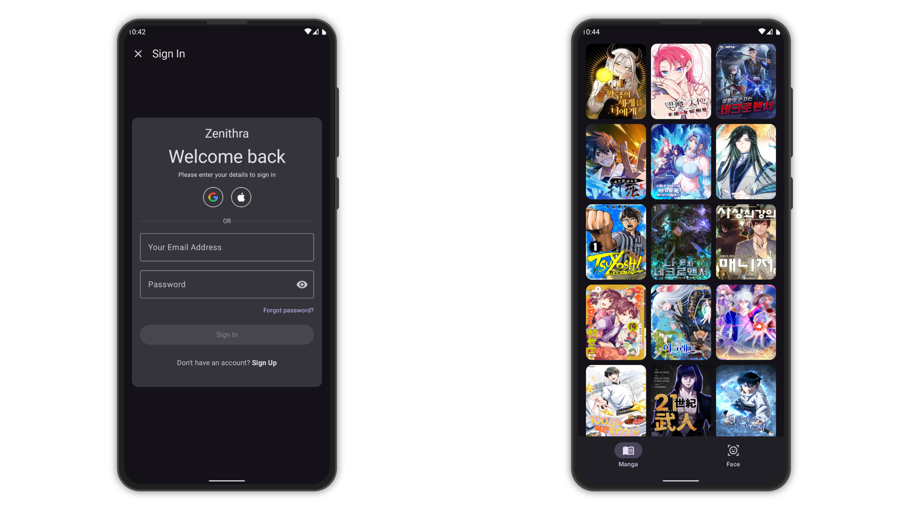
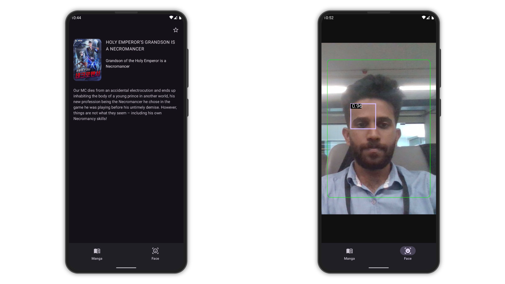

# MangaScope

A modern Android app built with Clean Architecture and Jetpack Compose. MangaScope allows users to
authenticate locally, browse manga fetched from an API with offline support, and use real-time face
detection powered by MediaPipe.

## Screenshots




## Features

- **User Authentication (Room DB)**
    - Sign in with email and password
    - Auto-register if email not found
    - Persistent login using DataStore

- **Manga Viewer**
    - Fetches paginated manga data from the MangaVerse API
    - Caches manga offline using Room DB
    - Smooth lazy loading with Jetpack Paging 3
    - Detail screen for each manga

- **Face Recognition**
    - Real-time face detection with MediaPipe Face Detector
    - Green or red bounding box based on face position

- **Clean Architecture + MVVM**
    - Modular structure with domain, data, and presentation layers
    - Single-activity app using Jetpack Navigation Component
    - UI built with Jetpack Compose

## Tech Stack

| Layer          | Technologies                                                                     |
|----------------|----------------------------------------------------------------------------------|
| UI             | Jetpack Compose, Material3                                                       |
| Navigation     | Jetpack Navigation Component (Single Activity)                                   |
| Dependency DI  | Koin                                                                             |
| Architecture   | MVVM + Clean Architecture                                                        |
| Local Storage  | Room DB, DataStore                                                               |
| Networking     | Ktor, Kotlin Coroutines                                                          |
| Pagination     | Paging 3                                                                         |
| Face Detection | MediaPipe Face Detector                                                          |
| API            | [MangaVerse API (RapidAPI)](https://rapidapi.com/sagararofie/api/mangaverse-api) |

## How to Run

1. **Clone the Repo**
   ```bash
   git clone https://github.com/mubashirpa/MangaScope.git
   cd MangaScope
   ```

2. **Open in Android Studio**

3. **Configure API Keys**
    * Sign up on [RapidAPI](https://rapidapi.com) for MangaVerse API
    * Add the API key to your `local.properties`
    ```properties
    RAPID_API_KEY=your_rapid_api_key
    ```

4. **Build and Run**

## Demo Video

[Watch Demo on YouTube](https://youtube.com/shorts/w2wPXKzBnv4?feature=share)

## Contact

For any queries or contributions, reach out
at [mubashirpa2002@gmail.com](mailto:mubashirpa2002@gmail.com)